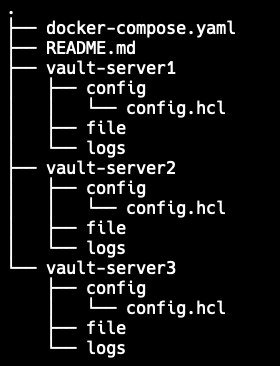

# How to run locally?

Before running the `docker compose up` locally, it's required to have the vault-server* folder structure look like the image below to run successfully.

# Understanding Raft protocol for leader and follower

| Role     | Read Access | Write Access |
|----------|-------------|--------------|
| Leader   | ✅ Yes       | ✅ Yes        |
| Follower | ✅ Yes       | ❌ No         |

# How to run?

`docker compose up`

# Clean up files

Simply run `sh clean-up.sh`